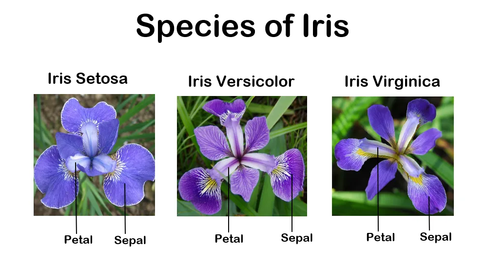

# Project for the Programming and Scripting Module

***author: Kyra Menai Hamilton***

## Background

The Iris dataset (originally sourced by Anderson in 1935) is a well examined and thoroughly evaluated dataset of three species of Iris flower (Setosa, Versicolor, Virginica) totalling 150 samples measuring four key features (sepal length/width, petal length/width) that aid in differentiation between the species. Not only highlighting the importance of field expert knowledge when designing a research project and its analysis, but also highlighting that there can be overlap between different species within the same genus (highlighted by the repeated overlap for Versicolor and Virginica for some features). A visual example of the Iris species collected for this dataset is included below.

Species of Iris in the dataset. (Source: https://3tw.medium.com/scikit-learn-the-iris-dataset-and-machine-learning-the-journey-to-a-new-skill-c8d2f537e087)

In 1936, Fisher used the dataset as an example of linear discriminant analysis, used for finding a linear combination of features that chan characterise or separate classes or objects (specifically two or more). Throughout the decades, the Iris dataset has been used thoroughly as an example dataset for machine learning and algorithm development and is stored as an open access dataset in the UCI Machine Learning Repository.

## Overview of project

This project focused on using the data in a number of different statistical tests to see what patterns were visible in the data, whether there were indeed differences between the species, and what pairs of features had influence over the other.

Initial **exploratory data analysis** described the shape of the dataset (150 samples 5 variables). A check on **first and last five rows** of the dataset was conduced, and the presence of missing values was checked (none were found). The **summary statistics** were initially conducted on the dataset as a whole, before being split by species for a more granular analysis. For the overall **summary statistics** it was found that petal length had the largest **standard deviation** (difference from mean value) of 1.76 respectively, suggesting that they varied more widely across samples compared to sepal features, indicating that maybe this would be useful feature to investigate further to see where these differences were.

**Boxplots** and **histograms** were plotted for each of the four features with the samples separated by species. **Boxplots** helped with finding outliers in the data, whilst the Histograms showed the frequency of specific measurements for each feature. Both of these plots highlighted that the measurements for the Setosa species of Iris flower separated from the other two species for all four of the features. Versicolor and Virginica overlap considerably for the sepal features (length/width), however, species separation was seen for all 3 species for the petal features (length/width) suggesting that these would be useful features in differentiating between species. The **scatterplots** showed similar results.

**Pairwise comparison (pairplot)** was also conducted on the data in order do get an overall quick analysis of the relationship between different pairs of features. Petal length vs. petal width again showed the most distinct clustering of the data by species, adding weight to the theory that the petal features would be useful in differentiating between Iris species. This is further highlighted by the **correlation matrix** where a strong positive correlation is shown between petal length and petal width ( r = 0.96).

To further analyse the variation within the data and to see where most of the differences between features for the species originates **principal component analysis (PCA)**. It was found that most variance within the data was seen between the petal features (the first principal components (PC1)). K-means clustering was conducted to check if there were indeed patterns within the Iris dataset.

**Linear regression** was used to test this further. Looking at feature vs feature and then also separating the analysis on a more granular scale to look specifically at the species results. Petal features have significant influence over one another (R2 = 0.93).

Finally **logistic regression** was conducted on the dataset to see whether it could be used to predict a species of Iris flower based purely on inputted values. The outcome for the accuracy of this potential model was 1.0, a perfect model, giving a high level of accuracy for any predictions made. This accuracy result is likely due to the simplicity and linear separability of the Iris dataset. A **confusion matrix** was plotted to aid in visualising the performance of the **logistic regression model**, aiding in seeing clearly where discrepancies would be in the species predicted.

## Conclusion

Assessing species-feature relationships aided in understanding where in the dataset the majority of the variance came from, which features had influence over one another, and which of the measured features would be the most useful as tools for differentiation. A number of these answers are the same. Most of the variance in the dataset comes from the petal length and petal width features, the petal length and width features also influenced one another, and these features were also shown to be the most useful in differentiating between and predicting the species of Iris flower.

## Code Explained

A detailed code explanation is provided in the code_explained.md - https://github.com/KaiiMenai/pands-project/blob/main/code_explained.md

## References

For a full list of the references used for this project please see references.md - https://github.com/KaiiMenai/pands-project/blob/main/references.md

# END OF README