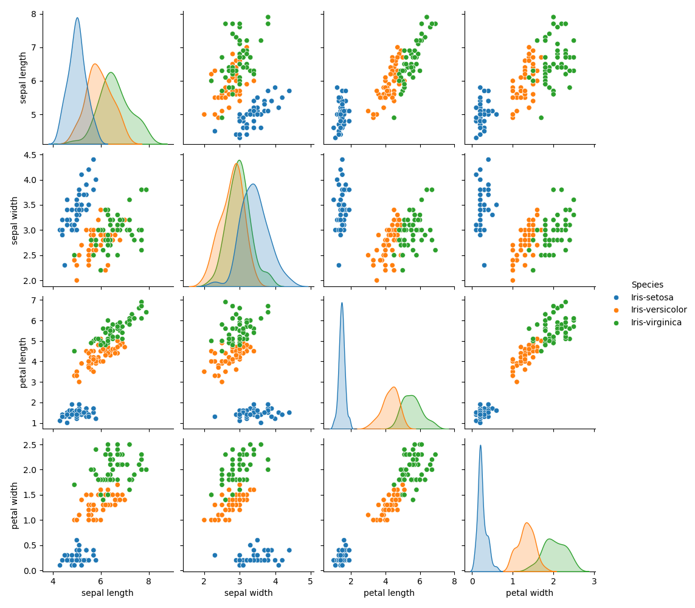

# Data Analysis conducted on the Iris Dataset

## Summary

The analysis used as a source for this document (analysis.py) was conducted using Python and the Pandas, Numpy, Matplotlib, Seaborn, and Scikit-learn libraries. The dataset was imported from the UCI Machine
Learning Repository and is a well-known dataset for classification tasks. The dataset contained 150 samples of iris flowers, with 5 columns: sepal length, sepal width, petal length, petal width, and species
(class). The dataset was used to conduct exploratory data analysis (EDA) and visualisation, as well as some machine learning tasks. Histogram, boxplot, scatterplot, PCA, pairplot, K-means clustering,
correlation matrix, and linear regression analysis were conducted on the dataset, and the results of each were saved as a PNG file.

*Please Note: Some observations taken from my own work for the Principles of Data Analytics Module, with wording changed to match what was required for this project. Link: https://github.com/KaiiMenai/poda-tasks/blob/main/tasks.ipynb*

## Background

Originally sourced by Anderson (1935), the Iris dataset has been used numerous times, with several different iterations available online. Some of these sources contain differing (and often noted as incorrect)
data points, as noted in the UCI Machine Learning Repository (https://archive.ics.uci.edu/dataset/53/iris). The dataset contained 150 samples of Iris flower, each with five noted variables, four numeric (sepal
and petal feature measurements), and one categorical (the three species), giving a total of 750 sample points throughout the entire dataset. Fisher (1936) made the Iris dataset well known through his paper
titled 'The Use of Multiple Measurements in Taxonomic Problems.' In the paper, the multivariate Iris dataset was used as an example of linear discriminant analysis. That is, a statistical method used to find a
linear combination of features that can either characterise or separate two or more classes of objects or events (https://en.wikipedia.org/wiki/Linear_discriminant_analysis;
https://www.ibm.com/think/topics/linear-discriminant-analysis).

Anderson (1935) originally collected the iris samples to study species variation and hybidisation. Anderson (1935) used the dataset to quantify the morphological differences and variation between Iris species,
focussing on the evolution of the Versicolor species, and how it may have come about as a hybrid of the Setosa and Virginica Iris species. An interesting point about the dataset is that two of the three
species, Iris Versicolor and Iris Virginica, were collected from the same pasture, on the same day, and measured using the same equipment. This is noteworthy for analysis, as Virginica and Versicolor often
appear to converge and are not as easily separable as the Setosa species (histograms, scatter plots, etc.). The Iris dataset has been extensively used as a training dataset, a learning dataset, and for
developing machine learning techniques. The scikit-learn library in Python uses the Iris dataset for demonstration purposes and explains how algorithms can learn from data samples (features) to predict class
labels (https://scikit-learn.org/stable/auto_examples/datasets/plot_iris_dataset.html; https://archive.ics.uci.edu/dataset/53/iris).

The Iris dataset also highlights the distinction between supervised and unsupervised learning. Supervised learning uses labeled data to train models for classification or regression, while unsupervised learning
explores patterns or clusters in unlabeled data (https://www.ibm.com/think/topics/linear-discriminant-analysis). The iris dataset gives an example of supervised learning problems, particularly multi-class
classification, where the goal is to predict an iris flower's species based on its measurements. Although the dataset only includes flower measurements (sepal length/width and petal length/width) and not
measurements for the entire plant, this focus reflects the expert judgment of Fisher and Anderson, who selected petal and sepal dimensions as meaningful discriminative features. This in turn highlights the
importance of domain expertise in data preparation and model design, suggesting that more efficient analysis and models are built when field experts are involved (Domingos, 2012; Kuhn, and Johnson, 2013).
Despite its age and simplicity, the Iris dataset remains a central teaching tool for introducing classification problems in machine learning.

## Exploratory Data Analysis

The shape of the dataset:
(150, 5)

The dataset contains 150 rows of data and 5 columns. The 5 columns are the species of isis flower (here noted as 'class'), and sepal length, sepal width, petal length, and petal width.

The first and last five rows of the dataset are printed below, as well as the column names within the dataset.

The first 5 rows of the dataset:
|    |   sepal length |   sepal width |   petal length |   petal width | class       |
|---:|---------------:|--------------:|---------------:|--------------:|:------------|
|  0 |            5.1 |           3.5 |            1.4 |           0.2 | Iris-setosa |
|  1 |            4.9 |           3   |            1.4 |           0.2 | Iris-setosa |
|  2 |            4.7 |           3.2 |            1.3 |           0.2 | Iris-setosa |
|  3 |            4.6 |           3.1 |            1.5 |           0.2 | Iris-setosa |
|  4 |            5   |           3.6 |            1.4 |           0.2 | Iris-setosa |

The last 5 rows of the dataset:
|     |   sepal length |   sepal width |   petal length |   petal width | class          |
|----:|---------------:|--------------:|---------------:|--------------:|:---------------|
| 145 |            6.7 |           3   |            5.2 |           2.3 | Iris-virginica |
| 146 |            6.3 |           2.5 |            5   |           1.9 | Iris-virginica |
| 147 |            6.5 |           3   |            5.2 |           2   | Iris-virginica |
| 148 |            6.2 |           3.4 |            5.4 |           2.3 | Iris-virginica |
| 149 |            5.9 |           3   |            5.1 |           1.8 | Iris-virginica |

The column names of the dataset:
Index(['sepal length', 'sepal width', 'petal length', 'petal width', 'class'], dtype='object')

These print checks were conducted to ensure that the data was correctly imported and in the correct format.
The number of rows and columns in the dataset:
None

The number of missing values in the dataset:
|              |   0 |
|:-------------|----:|
| sepal length |   0 |
| sepal width  |   0 |
| petal length |   0 |
| petal width  |   0 |
| class        |   0 |

The number of duplicate rows in the dataset:
3

The data types of each column in the dataset:
|              | 0       |
|:-------------|:--------|
| sepal length | float64 |
| sepal width  | float64 |
| petal length | float64 |
| petal width  | float64 |
| class        | object  |

Missing values were checked for in the dataset, there were none. If there were missing values, the dataset would need to be cleaned and sorted further before any analysis could be conducted. There were no
missing values in this dataset, so further cleaning was unnecessary. From the information table, it can be seen that where one column has categorical (object) data (class column - also referred to as species
for this dataset)  and the four other columns (sepal length, sepal width, petal length, and petal width) are of the float type (float64) (continuous variables) with non-Null entries. That is, there are no 0 /
null~ entries in the dataset.

Duplicates were removed from the data using the drop_duplicates function.
The code used for this was: ```data = iris_df.drop_duplicates(subset=class.)```

Value counts for each of the species:
class
Iris-setosa        50
Iris-versicolor    50
Iris-virginica     50
Name: count, dtype: int64

It can be seen that there are 50 samples for each of the three classes (species) of iris flower: Setosa, Versicolor, and Virginica.

Summary statistics for the whole dataset:
|       |   sepal length |   sepal width |   petal length |   petal width |
|:------|---------------:|--------------:|---------------:|--------------:|
| count |     150        |    150        |      150       |    150        |
| mean  |       5.84333  |      3.054    |        3.75867 |      1.19867  |
| std   |       0.828066 |      0.433594 |        1.76442 |      0.763161 |
| min   |       4.3      |      2        |        1       |      0.1      |
| 25%   |       5.1      |      2.8      |        1.6     |      0.3      |
| 50%   |       5.8      |      3        |        4.35    |      1.3      |
| 75%   |       6.4      |      3.3      |        5.1     |      1.8      |
| max   |       7.9      |      4.4      |        6.9     |      2.5      |

The summary statistics for the whole dataset shows that there are 150 samples in the dataset for each of the variables, the value displayed is the non-missing values, and thus it can be verified that the
dataset does not have any missing values. The Mean, Standard Deviation (std), Minimum (min) and Maximum (max), and the Lower, Median, and Higher Inter-quartile Ranges (25%, 50%, and 75%, respectively) values
are displayed for all four features (sepal length, sepal width, petal length, and petal width). The Mean was calculated by dividing the sum of all the values (per feature) by the number of values (150 in this
case). The mean for sepal length was 5.84 cm, sepal width was 3.05 cm, petal length was 3.76 cm, and for petal width was 1.20 cm. The Standard Deviation (std) is a measure of the spread of the data, that is, on
average, how much the values deviate from the mean. Sepal length had a mean of 5.84 cm with a std of 0.83, therefore the majority of values deviate by 0.83 cm (+/-) from the mean.  The mean for sepal width was
3.05 cm with a std of 0.43 cm, the sepal widths deviated by +/- 0.43 cm from the mean. The feature, sepal width, had less variability (std = 0.43) compared to that of sepal length (std = 0.83).  For petal
length, the mean was 3.76 cm with a std of 1.76 cm, thus most values for petal length deviated by 1.76 cm (+/-). Petal width had a mean of 1.20 cm with a std of 0.76 cm, the width of petals deviated by +/- 0.76
cm.  The measurement with the largest deviation from the mean is the petal length (std = 1.76), this suggests that petal lengths vary more widely across samples compared to the other features.

Outliers detected for each species:

Outliers for Iris-setosa:
  Column 'sepal length': No outliers detected
  Column 'sepal width': No outliers detected
  Column 'petal length': 4 outliers
  Column 'petal width': 2 outliers

Outliers for Iris-versicolor:
  Column 'sepal length': No outliers detected
  Column 'sepal width': No outliers detected
  Column 'petal length': 1 outliers
  Column 'petal width': No outliers detected

Outliers for Iris-virginica:
  Column 'sepal length': 1 outliers
  Column 'sepal width': 3 outliers
  Column 'petal length': No outliers detected
  Column 'petal width': No outliers detected

In the Summary Statistics for each species, the count shows that there are 50 samples in the dataset for each, the values displayed is the non-missing value, suggesting that there are no missing values present in the dataset.

## Individual Species Observations

### Iris Setosa

Setosa Statistics:
|       |   sepal length |   sepal width |   petal length |   petal width |
|:------|---------------:|--------------:|---------------:|--------------:|
| count |       50       |     50        |      50        |      50       |
| mean  |        5.006   |      3.418    |       1.464    |       0.244   |
| std   |        0.35249 |      0.381024 |       0.173511 |       0.10721 |
| min   |        4.3     |      2.3      |       1        |       0.1     |
| 25%   |        4.8     |      3.125    |       1.4      |       0.2     |
| 50%   |        5       |      3.4      |       1.5      |       0.2     |
| 75%   |        5.2     |      3.675    |       1.575    |       0.3     |
| max   |        5.8     |      4.4      |       1.9      |       0.6     |

The mean for sepal length was AAA cm, sepal width was BBB cm, petal length was CCC cm, and for petal width the mean was DDD cm. The mean was calculated by dividing the sum of all the values (per feature) by the
number of values (50 in this case, as it is done by species('class')). The standard deviation (std) is a measure of the spread of the data, that is, on average, how much the values deviate from the mean. For
sepal length the mean was AAA cm and the std was AAA, therefore most values deviated by AAA cm (+/-) from the mean. The mean for sepal width was BBB cm and the std was BBB, so most values deviated by +/- BBB cm
from the mean. Petal length had a mean of XXXXXXXX

### Iris Versicolor

Versicolor Statistics:
|       |   sepal length |   sepal width |   petal length |   petal width |
|:------|---------------:|--------------:|---------------:|--------------:|
| count |      50        |     50        |      50        |     50        |
| mean  |       5.936    |      2.77     |       4.26     |      1.326    |
| std   |       0.516171 |      0.313798 |       0.469911 |      0.197753 |
| min   |       4.9      |      2        |       3        |      1        |
| 25%   |       5.6      |      2.525    |       4        |      1.2      |
| 50%   |       5.9      |      2.8      |       4.35     |      1.3      |
| 75%   |       6.3      |      3        |       4.6      |      1.5      |
| max   |       7        |      3.4      |       5.1      |      1.8      |

The mean for sepal length was AAA cm, sepal width was BBB cm, petal length was CCC cm, and for petal width the mean was DDD cm. The mean was calculated by dividing the sum of all the values (per feature) by the
number of values (50 in this case, as it is done by species('class')). The standard deviation (std) is a measure of the spread of the data, that is, on average, how much the values deviate from the mean. For
sepal length the mean was AAA cm and the std was AAA, therefore most values deviated by AAA cm (+/-) from the mean. The mean for sepal width was BBB cm and the std was BBB, so most values deviated by +/- BBB cm
from the mean. Petal length had a mean of XXXXXXXX

### Iris Virginica


Virginica Statistics:
|       |   sepal length |   sepal width |   petal length |   petal width |
|:------|---------------:|--------------:|---------------:|--------------:|
| count |       50       |     50        |      50        |      50       |
| mean  |        6.588   |      2.974    |       5.552    |       2.026   |
| std   |        0.63588 |      0.322497 |       0.551895 |       0.27465 |
| min   |        4.9     |      2.2      |       4.5      |       1.4     |
| 25%   |        6.225   |      2.8      |       5.1      |       1.8     |
| 50%   |        6.5     |      3        |       5.55     |       2       |
| 75%   |        6.9     |      3.175    |       5.875    |       2.3     |
| max   |        7.9     |      3.8      |       6.9      |       2.5     |

The mean for sepal length was AAA cm, sepal width was BBB cm, petal length was CCC cm, and for petal width the mean was DDD cm. The mean was calculated by dividing the sum of all the values (per feature) by the
number of values (50 in this case, as it is done by species('class')). The standard deviation (std) is a measure of the spread of the data, that is, on average, how much the values deviate from the mean. For
sepal length the mean was AAA cm and the std was AAA, therefore most values deviated by AAA cm (+/-) from the mean. The mean for sepal width was BBB cm and the std was BBB, so most values deviated by +/- BBB cm
from the mean. Petal length had a mean of XXXXXXXX

## Boxplots by Feature


Boxplots were plotted for each of the four measured features (sepal length/width and petal length/width), the data in each of these four plots is separated by species. Boxplots make visualising range, potential
outliers, the inter-quartile range, and the median of the data more easily. There were nine outliers in total within the dataset between the four sepal/petal features. The Setosa species had three outliers in
the data for petal length, and two outliers in the data for petal width. The Virginica species had one outlier for sepal length and two outliers for sepal width. The Versicolor species had the fewest number of
outliers with only one outlier throughout the whole dataset, this outlier was for petal length. On average, Setosa was found to have the shortest sepal length and widest sepal width. Setosa was also found to
have the shortest petal length measurements and narrowest petal width. For Versicolor and Virginica, there were some differences visible in the measurements for the four features (sepal length/width, petal
length/width), however, there were instances where the feature measurements converged, particularly for sepal length and sepal width. Petal length and petal width displayed differences between species,
indicating that these feature measurements may be valuable for classification of Iris species. (https://www.nickmccullum.com/python-visualization/boxplot/ , https://www.ncl.ac.uk/webtemplate/ask-
assets/external/maths-resources/statistics/data-presentation/box-and-whisker-plots.html).

## Histograms by Feature


The histogram plots are all colour coded by species; blue for Setosa, orange for Versicolor, and green for Virginica. From the histogram plot for sepal length by species, the Setosa species showed a normal
distribution, with the majority of sepals being approximately 5.0 cm in length. The Versicolor species has a broad range of sepal lengths, with the most sepals being approximately 5.5 cm in length. The species
with the largest range in length of sepals and longest average sepal length is the Virginica species. For sepal width, it can be seen that overall, the data shows a normal distribution. Contrary to what was
observed for sepal length, the narrowest sepal width is the Versicolor species, with the Virginica species being in the middle of the range. The Setosa species had the greatest width and the broadest range in
values for sepal width. Similar to what was observed for sepal length, for petal length Setosa was the species with the shortest average length and the smallest range in measurements. An average petal length of
approximately 4.5 cm was observed for the Versicolor species and demonstrated a normal distribution. The Virginica species had, on average, the longest petal lengths, similar to what was observed for sepal
lengths. Setosa species had the narrowest petal width on average. The species with the mid-width measurement was the Versicolor species, with values between 1.0 cm and 2.0 cm. The widest petal widths were
observed in the Virginica species. It was observed that the sepal width and petal width for the Setosa species were contrary to one another. For the petal measurements of length and width, the Setosa species
was the shortest and narrowest and the values for this species also separated away from the other two species.

## Scatterplots


## Pairplot
A pairplot was used to visualise comparisons between pairs of features, sepal length vs, sepal width, sepal length vs petal length, sepal length vs petal width, petal length vs petal width etc. for the three
species of iris flower (Setosa in blue, Versicolor in orange, Verginica in green). Pairwise analysis outputs multiple sub-plots that are plotted in a matrix format; row name gives the x axis, column name gives
the y axis, and univariate distributions (histograms) are plotted on the diagonal from top left to bottom right for each feature (https://medium.com/analytics-vidhya/pairplot-visualization-16325cd725e6;
https://www.analyticsvidhya.com/blog/2024/02/pair-plots-in-machine-learning/; https://seaborn.pydata.org/generated/seaborn.pairplot.html; https://builtin.com/articles/seaborn-pairplot).




The pairplot displays a good overall view of the relationships between the feature variables, and due to each species having a different colour, it is easy to identify whether or not the species separate out
from one another. For different pairs of features following the pairwise pairplot comparison(s) there are different levels of overlap and / or separation seen. For sepal width vs sepal length, a high level of
overlap is seen between the Versicolor and Virginica species, Setosa separates out from the other two species and shows some variation in values. Petal length vs sepal length, showed the Setosa species
demonstrated complete separation and clustering, some separation was seen between the Versicolor and Virginica species. The distribution of data for petal width vs sepal length showed separation and clustering
of the Setosa species with Versicolor and Virginica only displaying slight overlap. Petal length vs sepal width, demonstrates that all species show some variation in their values, the Setosa species clusters
separately from the other two, and there was only a small level of overlap in the Versicolor and Virginica species. Similarly to that of petal width vs sepal length, petal width vs sepal width demonstrated
clustering of the Setosa species with Versicolor and Virginica only overlapping a very small amount. Petal width vs petal length demonstrated the most distinct separation between all species, there was a small
level of overlap between Versicolor and Virginica, however, these features offered the best clustering of the data (https://seaborn.pydata.org/generated/seaborn.pairplot.html; https://toxigon.com/seaborn-
pairplot-comprehensive-guide?utm_source=chatgpt.com; https://toxigon.com/seaborn-pairplot-guide?utm_source=chatgpt.com; https://builtin.com/articles/seaborn-pairplot).

## Correlation Matrix


## Principal Component Analysis (PCA)

A way to conduct relationship investigations is through Principal Component Analysis (PCA) - I did this for my PhD research and found it was a great way to clearly look at multiple data aspects at once
(https://scikit-learn.org/stable/auto_examples/decomposition/plot_pca_iris.html).An important note of PCA is that the data needs to be standardised for it. When standardising data, it's important that it is
scaled correctly, otherwise the results will appear skewed and purely incorrect.The analysis can then be run again. The standardised PCA analysis can then be viewed in a plot.The Principal Component Analysis
(PCA) transforms the original variables (sepal length, sepal width, petal length, petal width) into a new set of variables that are linear combinations of the original data, known as principal components
(Jolliffe and Cadima, 2016). The first principal component (PC1) captures the maximum variance within the data, whilst the second principal component (PC2) captures the remaining variance that is perpendicular
(orthogonal) to PC1. Any components following the first and second capture the remaining variance, again perpendicular to all previous components (Jolliffe and Cadima, 2016). Insights following the PCA show
that PC1 strongly correlated with petal features, suggesting that petal length and petal width are responsible for the majority, 72.8 %, of the variance within the data. PC2 captured the variance for the sepal
length and width, these were responsible for 23 % of the variance in the data. These results demonstrate that the first two components explain 95.8 % of the variance within the dataset.With so much variance
seen in PC1 for the petal features, it could indicate that these are good determining factors for use in species identification.

## K-means Clustering


### Linear Regression


A linear regression model was fitted to the iris dataset. The data was initially split into sepal feature and petal feature data.

### Linear Regression for Sepal Length vs Sepal Width


The sepal length vs sepal width plot displays a single regression line fitted across all data points. This plot displays the relationship between sepal length and sepal width for the iris flower species, Setosa
(in blue), Versicolor (in orange), and Virginica (in green).

The line shows the linear relationship between the length and width of the sepal features. Due to the near 'flat' elevation of the regression line a weak relationship between the features is observed. In the
top left of the plot the R<sup>2</sup> value is displayed, the value explains the variance in sepal width based on sepal length. The R<sup>2</sup> value is 0.01, a low value, as such it indicates that sepal
length is not a strong predictor for sepal width, thus other factors may influence the relationship between these features.

Similarly to observations from the boxplots and histograms, the Setosa species appears to cluster together in a distinctly separate group to the Versicolor and Virginica which overlap significantly in sepal
measurements. Indicating that it would be harder to distinguish between these species based solely on sepal measurements (https://www.investopedia.com/terms/r/r-squared.asp,
https://www.datacamp.com/tutorial/simple-linear-regression, https://www.ibm.com/think/topics/linear-regression, https://datatab.net/tutorial/linear-regression).

## Linear Regression for Petal Length vs Petal Width


The petal length vs petal width plot displays the relationships between petal length and petal width for the iris flower species, Setosa (in blue), Versicolor (in orange), and Virginica (in green). Compared to
the sepal features plot, the petal measurements plot displayed distinct clustering for each individual species.

The regression line was fitted across all data points, representing the overall linear relationship between petal length and width. The line had a sharp angle with data points clustered close to the line. The
R<sup>2</sup> value was 0.93, indicating that most of the variance for petal width was explained by petal length. Suggesting that petal length was a strong predictor of petal width. The Setosa species had
smaller petal widths and lengths and clearly separated from Versicolor and Virginica.

Setosa clearly separated from the other two species in both plots, making it easier to classify regardless of feature used for classification.

