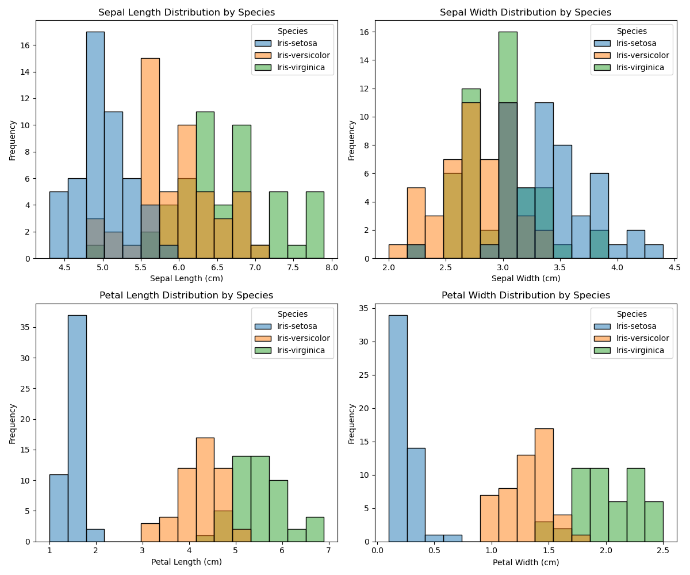

# Data Analysis conducted on the Iris Dataset

## Summary

The analysis used as a source for this document (analysis.py) was conducted using Python and the Pandas, Numpy, Matplotlib, Seaborn, and Scikit-learn libraries. The dataset was imported from the UCI Machine
Learning Repository and is a well-known dataset for classification tasks. The dataset contained 150 samples of iris flowers, with 5 columns: sepal length, sepal width, petal length, petal width, and species
(class). The dataset was used to conduct exploratory data analysis (EDA) and visualisation, as well as some machine learning tasks. Histogram, boxplot, scatterplot, PCA, pairplot, K-means clustering,
correlation matrix, and linear regression analysis were conducted on the dataset, and the results of each were saved as a PNG file.

*Please Note: Some observations taken from my own work for the Principles of Data Analytics Module, with wording changed to match what was required for this project. Link: https://github.com/KaiiMenai/poda-tasks/blob/main/tasks.ipynb*

## Background

Originally sourced by Anderson (1935), the Iris dataset has been used numerous times, with several different iterations available online. Some of these sources contain differing (and often noted as incorrect)
data points, as noted in the UCI Machine Learning Repository (https://archive.ics.uci.edu/dataset/53/iris). The dataset contained 150 samples of Iris flower, each with five noted variables, four numeric (sepal
and petal feature measurements), and one categorical (the three species), giving a total of 750 sample points throughout the entire dataset. Fisher (1936) made the Iris dataset well known through his paper
titled 'The Use of Multiple Measurements in Taxonomic Problems.' In the paper, the multivariate Iris dataset was used as an example of linear discriminant analysis. That is, a statistical method used to find a
linear combination of features that can either characterise or separate two or more classes of objects or events (https://en.wikipedia.org/wiki/Linear_discriminant_analysis;
https://www.ibm.com/think/topics/linear-discriminant-analysis).

Anderson (1935) originally collected the iris samples to study species variation and hybidisation. Anderson (1935) used the dataset to quantify the morphological differences and variation between Iris species,
focussing on the evolution of the Versicolor species, and how it may have come about as a hybrid of the Setosa and Virginica Iris species. An interesting point about the dataset is that two of the three
species, Iris Versicolor and Iris Virginica, were collected from the same pasture, on the same day, and measured using the same equipment. This is noteworthy for analysis, as Virginica and Versicolor often
appear to converge and are not as easily separable as the Setosa species (histograms, scatter plots, etc.). The Iris dataset has been extensively used as a training dataset, a learning dataset, and for
developing machine learning techniques. The scikit-learn library in Python uses the Iris dataset for demonstration purposes and explains how algorithms can learn from data samples (features) to predict class
labels (https://scikit-learn.org/stable/auto_examples/datasets/plot_iris_dataset.html; https://archive.ics.uci.edu/dataset/53/iris).

The Iris dataset also highlights the distinction between supervised and unsupervised learning. Supervised learning uses labeled data to train models for classification or regression, while unsupervised learning
explores patterns or clusters in unlabeled data (https://www.ibm.com/think/topics/linear-discriminant-analysis). The iris dataset gives an example of supervised learning problems, particularly multi-class
classification, where the goal is to predict an iris flower's species based on its measurements. Although the dataset only includes flower measurements (sepal length/width and petal length/width) and not
measurements for the entire plant, this focus reflects the expert judgment of Fisher and Anderson, who selected petal and sepal dimensions as meaningful discriminative features. This in turn highlights the
importance of domain expertise in data preparation and model design, suggesting that more efficient analysis and models are built when field experts are involved (Domingos, 2012; Kuhn, and Johnson, 2013).
Despite its age and simplicity, the Iris dataset remains a central teaching tool for introducing classification problems in machine learning.

## Exploratory Data Analysis

The shape of the dataset:
(150, 5)

The dataset contains 150 rows of data and 5 columns. The 5 columns are the species of isis flower (here noted as 'class'), and sepal length, sepal width, petal length, and petal width.

The first and last five rows of the dataset are printed below, as well as the column names within the dataset.

The first 5 rows of the dataset:
|    |   sepal length |   sepal width |   petal length |   petal width | class       |
|---:|---------------:|--------------:|---------------:|--------------:|:------------|
|  0 |            5.1 |           3.5 |            1.4 |           0.2 | Iris-setosa |
|  1 |            4.9 |           3   |            1.4 |           0.2 | Iris-setosa |
|  2 |            4.7 |           3.2 |            1.3 |           0.2 | Iris-setosa |
|  3 |            4.6 |           3.1 |            1.5 |           0.2 | Iris-setosa |
|  4 |            5   |           3.6 |            1.4 |           0.2 | Iris-setosa |

The last 5 rows of the dataset:
|     |   sepal length |   sepal width |   petal length |   petal width | class          |
|----:|---------------:|--------------:|---------------:|--------------:|:---------------|
| 145 |            6.7 |           3   |            5.2 |           2.3 | Iris-virginica |
| 146 |            6.3 |           2.5 |            5   |           1.9 | Iris-virginica |
| 147 |            6.5 |           3   |            5.2 |           2   | Iris-virginica |
| 148 |            6.2 |           3.4 |            5.4 |           2.3 | Iris-virginica |
| 149 |            5.9 |           3   |            5.1 |           1.8 | Iris-virginica |

The column names of the dataset:
Index(['sepal length', 'sepal width', 'petal length', 'petal width', 'class'], dtype='object')

These print checks were conducted to ensure that the data was correctly imported and in the correct format.
The number of rows and columns in the dataset:
None

The number of missing values in the dataset:
|              |   0 |
|:-------------|----:|
| sepal length |   0 |
| sepal width  |   0 |
| petal length |   0 |
| petal width  |   0 |
| class        |   0 |

The number of duplicate rows in the dataset:
3

The data types of each column in the dataset:
|              | 0       |
|:-------------|:--------|
| sepal length | float64 |
| sepal width  | float64 |
| petal length | float64 |
| petal width  | float64 |
| class        | object  |

Missing values were checked for in the dataset, there were none. If there were missing values, the dataset would need to be cleaned and sorted further before any analysis could be conducted. There were no
missing values in this dataset, so further cleaning was unnecessary. From the information table, it can be seen that where one column has categorical (object) data (class column - also referred to as species
for this dataset)  and the four other columns (sepal length, sepal width, petal length, and petal width) are of the float type (float64) (continuous variables) with non-Null entries. That is, there are no 0 /
null~ entries in the dataset.

Duplicates were removed from the data using the drop_duplicates function.
The code used for this was: ```data = iris_df.drop_duplicates(subset=class.)```

Value counts for each of the species:
class
Iris-setosa        50
Iris-versicolor    50
Iris-virginica     50
Name: count, dtype: int64

It can be seen that there are 50 samples for each of the three classes (species) of iris flower: Setosa, Versicolor, and Virginica.

Summary statistics for the whole dataset:
|       |   sepal length |   sepal width |   petal length |   petal width |
|:------|---------------:|--------------:|---------------:|--------------:|
| count |     150        |    150        |      150       |    150        |
| mean  |       5.84333  |      3.054    |        3.75867 |      1.19867  |
| std   |       0.828066 |      0.433594 |        1.76442 |      0.763161 |
| min   |       4.3      |      2        |        1       |      0.1      |
| 25%   |       5.1      |      2.8      |        1.6     |      0.3      |
| 50%   |       5.8      |      3        |        4.35    |      1.3      |
| 75%   |       6.4      |      3.3      |        5.1     |      1.8      |
| max   |       7.9      |      4.4      |        6.9     |      2.5      |

The summary statistics for the whole dataset shows that there are 150 samples in the dataset for each of the variables, the value displayed is the non-missing values, and thus it can be verified that the
dataset does not have any missing values. The Mean, Standard Deviation (std), Minimum (min) and Maximum (max), and the Lower, Median, and Higher Inter-quartile Ranges (25%, 50%, and 75%, respectively) values
are displayed for all four features (sepal length, sepal width, petal length, and petal width). The Mean was calculated by dividing the sum of all the values (per feature) by the number of values (150 in this
case). The mean for sepal length was 5.84 cm, sepal width was 3.05 cm, petal length was 3.76 cm, and for petal width was 1.20 cm. The Standard Deviation (std) is a measure of the spread of the data, that is, on
average, how much the values deviate from the mean. Sepal length had a mean of 5.84 cm with a std of 0.83, therefore the majority of values deviate by 0.83 cm (+/-) from the mean.  The mean for sepal width was
3.05 cm with a std of 0.43 cm, the sepal widths deviated by +/- 0.43 cm from the mean. The feature, sepal width, had less variability (std = 0.43) compared to that of sepal length (std = 0.83).  For petal
length, the mean was 3.76 cm with a std of 1.76 cm, thus most values for petal length deviated by 1.76 cm (+/-). Petal width had a mean of 1.20 cm with a std of 0.76 cm, the width of petals deviated by +/- 0.76
cm.  The measurement with the largest deviation from the mean is the petal length (std = 1.76), this suggests that petal lengths vary more widely across samples compared to the other features.

Outliers detected for each species:

Outliers for Iris-setosa:
  Column 'sepal length': No outliers detected
  Column 'sepal width': No outliers detected
  Column 'petal length': 4 outliers
  Column 'petal width': 2 outliers

Outliers for Iris-versicolor:
  Column 'sepal length': No outliers detected
  Column 'sepal width': No outliers detected
  Column 'petal length': 1 outliers
  Column 'petal width': No outliers detected

Outliers for Iris-virginica:
  Column 'sepal length': 1 outliers
  Column 'sepal width': 3 outliers
  Column 'petal length': No outliers detected
  Column 'petal width': No outliers detected

In the Summary Statistics for each species, the count shows that there are 50 samples in the dataset for each, the values displayed is the non-missing value, suggesting that there are no missing values present in the dataset.

## Individual Species Observations

### Iris Setosa

Setosa Statistics:
|       |   sepal length |   sepal width |   petal length |   petal width |
|:------|---------------:|--------------:|---------------:|--------------:|
| count |       50       |     50        |      50        |      50       |
| mean  |        5.006   |      3.418    |       1.464    |       0.244   |
| std   |        0.35249 |      0.381024 |       0.173511 |       0.10721 |
| min   |        4.3     |      2.3      |       1        |       0.1     |
| 25%   |        4.8     |      3.125    |       1.4      |       0.2     |
| 50%   |        5       |      3.4      |       1.5      |       0.2     |
| 75%   |        5.2     |      3.675    |       1.575    |       0.3     |
| max   |        5.8     |      4.4      |       1.9      |       0.6     |

The mean for sepal length was AAA cm, sepal width was BBB cm, petal length was CCC cm, and for petal width the mean was DDD cm. The mean was calculated by dividing the sum of all the values (per feature) by the
number of values (50 in this case, as it is done by species('class')). The standard deviation (std) is a measure of the spread of the data, that is, on average, how much the values deviate from the mean. For
sepal length the mean was AAA cm and the std was AAA, therefore most values deviated by AAA cm (+/-) from the mean. The mean for sepal width was BBB cm and the std was BBB, so most values deviated by +/- BBB cm
from the mean. Petal length had a mean of XXXXXXXX

### Iris Versicolor

Versicolor Statistics:
|       |   sepal length |   sepal width |   petal length |   petal width |
|:------|---------------:|--------------:|---------------:|--------------:|
| count |      50        |     50        |      50        |     50        |
| mean  |       5.936    |      2.77     |       4.26     |      1.326    |
| std   |       0.516171 |      0.313798 |       0.469911 |      0.197753 |
| min   |       4.9      |      2        |       3        |      1        |
| 25%   |       5.6      |      2.525    |       4        |      1.2      |
| 50%   |       5.9      |      2.8      |       4.35     |      1.3      |
| 75%   |       6.3      |      3        |       4.6      |      1.5      |
| max   |       7        |      3.4      |       5.1      |      1.8      |

The mean for sepal length was AAA cm, sepal width was BBB cm, petal length was CCC cm, and for petal width the mean was DDD cm. The mean was calculated by dividing the sum of all the values (per feature) by the
number of values (50 in this case, as it is done by species('class')). The standard deviation (std) is a measure of the spread of the data, that is, on average, how much the values deviate from the mean. For
sepal length the mean was AAA cm and the std was AAA, therefore most values deviated by AAA cm (+/-) from the mean. The mean for sepal width was BBB cm and the std was BBB, so most values deviated by +/- BBB cm
from the mean. Petal length had a mean of XXXXXXXX

### Iris Virginica

Virginica Statistics:
|       |   sepal length |   sepal width |   petal length |   petal width |
|:------|---------------:|--------------:|---------------:|--------------:|
| count |       50       |     50        |      50        |      50       |
| mean  |        6.588   |      2.974    |       5.552    |       2.026   |
| std   |        0.63588 |      0.322497 |       0.551895 |       0.27465 |
| min   |        4.9     |      2.2      |       4.5      |       1.4     |
| 25%   |        6.225   |      2.8      |       5.1      |       1.8     |
| 50%   |        6.5     |      3        |       5.55     |       2       |
| 75%   |        6.9     |      3.175    |       5.875    |       2.3     |
| max   |        7.9     |      3.8      |       6.9      |       2.5     |

The mean for sepal length was AAA cm, sepal width was BBB cm, petal length was CCC cm, and for petal width the mean was DDD cm. The mean was calculated by dividing the sum of all the values (per feature) by the
number of values (50 in this case, as it is done by species('class')). The standard deviation (std) is a measure of the spread of the data, that is, on average, how much the values deviate from the mean. For
sepal length the mean was AAA cm and the std was AAA, therefore most values deviated by AAA cm (+/-) from the mean. The mean for sepal width was BBB cm and the std was BBB, so most values deviated by +/- BBB cm
from the mean. Petal length had a mean of XXXXXXXX

## Boxplots by Feature


Boxplots were plotted for each of the four measured features (sepal length/width and petal length/width), the data in each of these four plots is separated by species. Boxplots make visualising range, potential
outliers, the inter-quartile range, and the median of the data more easily. There were nine outliers in total within the dataset between the four sepal/petal features. The Setosa species had three outliers in
the data for petal length, and two outliers in the data for petal width. The Virginica species had one outlier for sepal length and two outliers for sepal width. The Versicolor species had the fewest number of
outliers with only one outlier throughout the whole dataset, this outlier was for petal length. On average, Setosa was found to have the shortest sepal length and widest sepal width. Setosa was also found to
have the shortest petal length measurements and narrowest petal width. For Versicolor and Virginica, there were some differences visible in the measurements for the four features (sepal length/width, petal
length/width), however, there were instances where the feature measurements converged, particularly for sepal length and sepal width. Petal length and petal width displayed differences between species,
indicating that these feature measurements may be valuable for classification of Iris species. (https://www.nickmccullum.com/python-visualization/boxplot/ , https://www.ncl.ac.uk/webtemplate/ask-
assets/external/maths-resources/statistics/data-presentation/box-and-whisker-plots.html).

## Histograms by Feature



The histogram plots are all colour coded by species; green for Setosa, orange for Versicolor, and blue for Virginica. For some reason the colours are different to those used in the boxplots, this is not an
issue, but it is worth noting. The histograms show the frequency of measurements for each feature (sepal length/width and petal length/width) by species. The x-axis shows the range of values for each feature,
while the y-axis shows the frequency of measurements for each feature.From the histogram plot of the frequency of measurements for sepal length by species of iris flower, the Setosa species showed a normal
distribution, with the majority of sepals being approximately 5.0 cm in length. The Versicolor species had a broad range of sepal lengths, with the most sepals being approximately 5.5 cm in length. The species
with the largest range in length of sepals and longest average sepal length is the Virginica species. A number of the Versicolor and Virginica species samples overlapped in terms of frequency of measurements
for sepal length, with some small overlap in values also seen for the Setosa iris species.

Contrary to what was observed for sepal length, the narrowest sepal width is the Versicolor species, with the Virginica species being in the middle of the range. The Setosa species had the widest sepals and the
broadest range in values for sepal width. The data for sepal width overlaps between the three species, with some overlap in values between the Setosa and Versicolor species. The data for sepal width is not
normally distributed, as there are two peaks in the data, one at 2.5 cm and one at 3.5 cm. This suggests that there may be two different groups of iris flowers within the dataset. Of course, as the dataset has
been colour coded and visually distinguishable in the histograms because of these colours, we know that there are three species of iris flower within the dataset.

Similar to sepal length, for petal length Setosa was the species with the shortest average length and the smallest range in measurements. An average petal length of approximately 4.5 cm was observed for the
Versicolor species and demonstrated a normal distribution. The Virginica species had, on average, the longest petal lengths, similar to what was observed for sepal lengths.

Setosa species had the narrowest petal width on average. The species with the mid-range width measurement was the Versicolor species, with values between 1.0 cm and 2.0 cm. The widest petal widths were observed
in the Virginica species. It was observed that the sepal width and petal width for the Setosa species were contrary to one another. For the petal measurements of length and width, the Setosa species was the
shortest and narrowest and the values for this species also separated away from the other two species.

## Scatterplots


The PNG contains two plots one for sepal features (sepal length vs sepal width) and one for petal features (petal length vs petal width). The scatter plots display Setosa in blue, Versicolor in orange, and
Virginica in green. Setosa shows a clearly separate grouping for sepal features, whereas Versicolor and Virginica show a high level of overlap in their plotted values fpr the sepal features. There is however,
more clear separation between Versicolor and Virginica for the petal features, Setosa once again, clearly separates into a group from the other two species.

From the scatter plots, as Setosa separates from the other two iris species, Versicolor and Virginica, it may be easier to discern of measurements are for the Setosa species. Due to the overlap between the
Versicolor and Virginica species, it may be more difficult to differentiate between these species (this would also be reflective of the fact that both were collected from the same pasture on the same day). The
Virginica and Versicolor species appeared to be of similar value ranges and overlap for sepal length vs sepal width. This would suggest that the petal length and petal width features would be the most useful in
differentiating between species.

## Pairplot

A pairplot was used to visualise comparisons between pairs of features, sepal length vs, sepal width, sepal length vs petal length, sepal length vs petal width, petal length vs petal width etc. for the three
species of iris flower (Setosa in blue, Versicolor in orange, Verginica in green). Pairwise analysis outputs multiple sub-plots that are plotted in a matrix format; row name gives the x axis, column name gives
the y axis, and univariate distributions (histograms) are plotted on the diagonal from top left to bottom right for each feature (https://medium.com/analytics-vidhya/pairplot-visualization-16325cd725e6;
https://www.analyticsvidhya.com/blog/2024/02/pair-plots-in-machine-learning/; https://seaborn.pydata.org/generated/seaborn.pairplot.html; https://builtin.com/articles/seaborn-pairplot).


The pairplot displays a good overall view of the relationships between the feature variables, and due to each species having a different colour, it is easy to identify whether or not the species separate out
from one another. For different pairs of features following the pairwise pairplot comparison(s) there are different levels of overlap and / or separation seen. For sepal width vs sepal length, a high level of
overlap is seen between the Versicolor and Virginica species, Setosa separates out from the other two species and shows some variation in values. Petal length vs sepal length, showed the Setosa species
demonstrated complete separation and clustering, some separation was seen between the Versicolor and Virginica species. The distribution of data for petal width vs sepal length showed separation and clustering
of the Setosa species with Versicolor and Virginica only displaying slight overlap. Petal length vs sepal width, demonstrates that all species show some variation in their values, the Setosa species clusters
separately from the other two, and there was only a small level of overlap in the Versicolor and Virginica species. Similarly to that of petal width vs sepal length, petal width vs sepal width demonstrated
clustering of the Setosa species with Versicolor and Virginica only overlapping a very small amount. Petal width vs petal length demonstrated the most distinct separation between all species, there was a small
level of overlap between Versicolor and Virginica, however, these features offered the best clustering of the data (https://seaborn.pydata.org/generated/seaborn.pairplot.html; https://toxigon.com/seaborn-
pairplot-comprehensive-guide?utm_source=chatgpt.com; https://toxigon.com/seaborn-pairplot-guide?utm_source=chatgpt.com; https://builtin.com/articles/seaborn-pairplot).

## Correlation Matrix


## Principal Component Analysis (PCA)

A way to conduct relationship investigations is through Principal Component Analysis (PCA) - I did this for my PhD research and found it was a great way to clearly look at multiple data aspects at once
(https://scikit-learn.org/stable/auto_examples/decomposition/plot_pca_iris.html).An important note of PCA is that the data needs to be standardised for it. When standardising data, it's important that it is
scaled correctly, otherwise the results will appear skewed and purely incorrect.The analysis can then be run again. The standardised PCA analysis can then be viewed in a plot.The Principal Component Analysis
(PCA) transforms the original variables (sepal length, sepal width, petal length, petal width) into a new set of variables that are linear combinations of the original data, known as principal components
(Jolliffe and Cadima, 2016). The first principal component (PC1) captures the maximum variance within the data, whilst the second principal component (PC2) captures the remaining variance that is perpendicular
(orthogonal) to PC1. Any components following the first and second capture the remaining variance, again perpendicular to all previous components (Jolliffe and Cadima, 2016). Insights following the PCA show
that PC1 strongly correlated with petal features, suggesting that petal length and petal width are responsible for the majority, 72.8 %, of the variance within the data. PC2 captured the variance for the sepal
length and width, these were responsible for 23 % of the variance in the data. These results demonstrate that the first two components explain 95.8 % of the variance within the dataset.With so much variance
seen in PC1 for the petal features, it could indicate that these are good determining factors for use in species identification.

## K-means Clustering


### Linear Regression

A linear regression model was fitted to the iris dataset. The data was initially split into sepal feature and petal feature data.

### Linear Regression for Sepal Length vs Sepal Width


The sepal length vs sepal width plot displays a single regression line fitted across all data points. This plot displays the relationship between sepal length and sepal width for the iris flower species, Setosa
(in blue), Versicolor (in orange), and Virginica (in green).

The line shows the linear relationship between the length and width of the sepal features. Due to the near 'flat' elevation of the regression line a weak relationship between the features is observed. In the
top left of the plot the R<sup>2</sup> value is displayed, the value explains the variance in sepal width based on sepal length. The R<sup>2</sup> value is 0.01, a low value, as such it indicates that sepal
length is not a strong predictor for sepal width, thus other factors may influence the relationship between these features.

Similarly to observations from the boxplots and histograms, the Setosa species appears to cluster together in a distinctly separate group to the Versicolor and Virginica which overlap significantly in sepal
measurements. Indicating that it would be harder to distinguish between these species based solely on sepal measurements (https://www.investopedia.com/terms/r/r-squared.asp,
https://www.datacamp.com/tutorial/simple-linear-regression, https://www.ibm.com/think/topics/linear-regression, https://datatab.net/tutorial/linear-regression).

## Linear Regression for Petal Length vs Petal Width


The petal length vs petal width plot displays the relationships between petal length and petal width for the iris flower species, Setosa (in blue), Versicolor (in orange), and Virginica (in green). Compared to
the sepal features plot, the petal measurements plot displayed distinct clustering for each individual species.

The regression line was fitted across all data points, representing the overall linear relationship between petal length and width. The line had a sharp angle with data points clustered close to the line. The
R<sup>2</sup> value was 0.93, indicating that most of the variance for petal width was explained by petal length. Suggesting that petal length was a strong predictor of petal width. The Setosa species had
smaller petal widths and lengths and clearly separated from Versicolor and Virginica.

Compared to what was observed for sepal feature relationships, for petal features, Versicolor and Virginica were more distinctly clustered and separate from each other
(https://www.investopedia.com/terms/r/r-squared.asp, https://www.datacamp.com/tutorial/simple-linear-regression, https://www.ibm.com/think/topics/linear-regression, https://datatab.net/tutorial/linear-
regression).

Setosa clearly separated from the other two species in both plots, making it easier to classify regardless of feature used for classification.

## Linear Regression and R^2 by Species


For both plots the species are colour coded (Setosa is blue, Versicolor is orange, Verginica is green).

The left plot displays the Linear Regression for the Sepal features (Length vs Width). Setosa, shown in blue, had an R<sup>2</sup> value of 0.56. Versicolor (orange), showed an R<sup>2</sup> value of 0.28.
Virginica, in green, had an R<sup>2</sup> value of 0.21. Of the three species, Setosa is the species where sepal features, length and width, may influence the variance in one another. However, due to the
overlap between Versicolor (R<sup>2</sup> = 0.28) and Virginica (R<sup>2</sup> = 0.21), other factors may be responsible for the variance observed between the Sepal features.

In the right plot (Petal Length vs Petal Width), the three species Setosa (blue), Versicolor (orange), and Virginica (green) Linear Regression for the Petal Features is plotted. The three species have clearly
separated from one another. However, although on a dataset wide basis Petal Features have influence over one another (R<sup>2</sup> = 0.93), at species level, the results are quite different. Out of the three
species, the only one to display influence on variance for petal features over one another was the Virginica species (R<sup>2</sup> = 0.62), with the Setosa and Virginica species showing that other factors may
be responsible for the variance between these features, with R<sup>2</sup> values of 0.09 and 0.10, respectively. (James *et al*., 2013, https://scikit-
learn.org/stable/modules/generated/sklearn.linear_model.LinearRegression.html, https://medium.com/%40brandon93.w/regression-model-evaluation-metrics-r-squared-adjusted-r-squared-mse-rmse-and-mae-24dcc0e4cbd3,
https://www.geeksforgeeks.org/ml-mathematical-explanation-of-rmse-and-r-squared-error/)

## Logistic Regression Model

Although a linear regression model has previously been used to analyse the data, it is possible to predict a species based on the measurements taken from a flower through using a logistic regression model.
Using a Logistic Regression Model on the iris dataset is appropriate due to the relatively small size of the dataset (Log Regression Models work well with small, linearly separable datasets). The model is good
for multi-class classification, as seen in the dataset with the 'species' classifications. When looking at the results of the logistic regression model, there are some things that should be taken into
consideration. The iris dataset is relatively small, and when it is split on a species level, it has even fewer values. Although Logistic Regression Models work well on small datasets, splitting the dataset
into multiple species creates a condensed dataset  and may, not be representative of the wider population. (https://scikit-learn.org/stable/modules/generated/sklearn.linear_model.LogisticRegression.html;
https://www.ibm.com/think/topics/logistic-regression)

Logistic Regression for Species Classification Results:
Accuracy: 1.0000

Classification Report:
                 precision    recall  f1-score   support

    Iris-setosa       1.00      1.00      1.00        10
Iris-versicolor       1.00      1.00      1.00         9
 Iris-virginica       1.00      1.00      1.00        11

       accuracy                           1.00        30
      macro avg       1.00      1.00      1.00        30
   weighted avg       1.00      1.00      1.00        30

|                 |   precision |   recall |   f1-score |   support |
|:----------------|------------:|---------:|-----------:|----------:|
| Iris-setosa     |           1 |        1 |          1 |        10 |
| Iris-versicolor |           1 |        1 |          1 |         9 |
| Iris-virginica  |           1 |        1 |          1 |        11 |
| accuracy        |           1 |        1 |          1 |         1 |
| macro avg       |           1 |        1 |          1 |        30 |
| weighted avg    |           1 |        1 |          1 |        30 |Example Prediction (measurements in cm).
- Predicted species for [5.1, 3.5, 1.4, 0.2]: Iris-setosa

For the iris dataset, the Logistic Regression Model achieves high accuracy (~ 97 %), this is due to the simplicity and linear separability of the iris dataset. Accuracy for the Logistic Regression Model is
calculated as the ratio of correct predictions to total predictions. The columns for precision and recall measure class specific performance in the model, and the f1-score column gives a balances metric for
imbalanced classes (not a problem here as the iris dataset is balanced). In the support column, it can be seen that the Verginica species has a value of 9, demonstrating a slightly lower recall, this is likely
due to the overlap with Versicolor. As seen throughout previous testing on the dataset, the majority of the confusion in the dataset occurs between the Versicolor and Virginica species.

Initially upon looking at the Classification Report, it could be assumed that the results do not highlight anything. This report provides detailed insights into the performance of the model for each species,
showing areas where the model performs well or struggles. However, due to the size of the dataset (150 samples), and then the test set being even smaller (30 samples), it makes it easier for the model to
achieve perfect accuracy, this model produced an accuracy of 1.0 (perfect accuracy). A linearly separable dataset is one that shows clear distinctions between classes, for the iris dataset that class difference
is seen most clearly in the petal length/width. As the iris dataset is balanced, with an equal number of samples for each class (50), the risk of bias in the model is reduced. In order to improve accuracy and
reliability, the model should be rerun a number of times using different splits of the data, this is called cross-validation.

## Confusion Matrix

A confusion matrix was plotted to visualise the results. The confusion matrix is a performance evaluation tool for classification models. It provides a summary of the prediction results by comparing the actual
values (rows) against the predicted values (columns). The confusion matrix helps with understanding how well the logistic regression model classifies the different species of iris and whether there are any
species that are more prone to misclassification (https://www.analyticsvidhya.com/blog/2020/04/confusion-matrix-machine-learning/). To interpret the matrix, the structure and values within the matrix are
important to understand what it shows. The rows within the matrix represent the Actual Classes (actual species of iris), whilst the columns represent the Predicted Classes (predicted species from the model
output). The matrix contains a number of values, on the diagonal line (from top left to bottom right) the values denote the Correct Predictions, where the actual and predicted classes (species) match. All other
values from the diagonal are those denoting Misclassifications, where the actual and predicted species differ. Although the Logistic Regression Model gives a value for Accuracy (1.000) for species
classification, the classification report and confusion matrix aid in giving a clearer picture of the data and the accuracy of predictions made with the model.

## Conclusion

The analysis of the Iris dataset has provided valuable insights into the relationships between features (sepal length/width, petal length/width) and the target variable (species). The dataset was found to be
balanced, with 50 samples for each of the three species (Setosa, Versicolor, Virginica). The summary statistics showed that there were no missing values in the dataset, and the features had different means and
standard deviations. The box plots and histograms provided visualisations of the distribution of features by species, and the scatter plots showed the relationships between features and the target variable.

For a number of plots (histograms, scatter plots, linear regression, box plots) the Setosa species clearly clusters separately to the Versicolor and Virginica species, for both sepal and petal features. For
petal features, all species separated from one another (with some minor overlap visible between the Versicolor and Virginica species), indicating that petal features were more distinguishable between species,
and thus would be more useful in classification. The PCA and K-means clustering techniques were used to reduce the dimensionality of the data and identify clusters in the data, respectively. Following the
principal component analysis (PCA) the observations about petal features being more distinguishable between species, commpared to sepal features was solidified as it was found that PC1 (first principal
component) was responsible for 72.8 % of the variability seen within the data, the PC1 was referring to the petal length and width features. The feature correlation matrix heat map also displayed the difference
between species based onn petal features, where petal length vs petal width resulted in r = 0.96 indicating that the petal length and width showed a strong positive correlation and that their measurements often
varied together. The Logistic Regression (classification techniques) were used to predict the species of iris flowers based on their features, and the Linear Regression (regression techniques) were used to
predict continuous values based on features.For the linear regression (LRM) analysis, petal length vs petal width gave an R^2 value of 0.93, indicating that most of the variance in petal width can be explained
by petal length. Some predictions were made for petal width following an 80 - 20 split in the data for training and testing, respectively.

The analysis has shown that the dataset is suitable for classification and regression tasks, and the techniques used have provided valuable insights into the relationships between features and the target
variable. The analysis has demonstrated that the features (sepal length/width, petal length/width) are valuable for classification of iris species, and the techniques used have provided valuable insights into
the relationships between features and the target variable. However, in order to have a more reliable method for predicting the species using a linear regression (or logistic regression) model, a larger sample
population is essential in order to accurately visualise and calculate the nuances between such species based on their features. In terms of model accuracy, reliability, and consistent repeatability the size of
the dataset may be considered a limiting factor. However, the data does efficiently demonstrate what a linear based dataset can show through various forms of analysis.

## References

### Academic Sources

Anderson, E. (1935). *The irises of the Gaspé peninsula*, Bulletin of the American Iris Society, 59, pp. 2–5.

Cheeseman, P., Kelly, J., Self, M. and Taylor, W. (1988). *AUTOCLASS II conceptual clustering system finds 3 classes in the data*, MLC Proceedings, pp. 54–64. Available at: https://cdn.aaai.org/AAAI/1988/AAAI88-108.pdf

Dasarathy, B.V. (1980). *Nosing around the neighborhood: a new system structure and classification rule for recognition in partially exposed environments*, IEEE Transactions on Pattern Analysis and Machine Intelligence, PAMI-2(1), pp. 67–71. Available at: https://www.academia.edu/30910064/Nosing_Around_the_Neighborhood_A_New_System_Structure_and_Classification_Rule_for_Recognition_in_Partially_Exposed_Environments

Domingos, P. (2012). *A few useful things to know about machine learning*, Communications of the ACM, 55(10), pp. 78–87. Available at: https://dl.acm.org/doi/10.1145/2347736.2347755

Duda, R.O. and Hart, P.E. (1973). *Pattern Classification and Scene Analysis*. New York: John Wiley & Sons. Available at: https://www.semanticscholar.org/paper/Pattern-classification-and-scene-analysis-Duda-Hart/b07ce649d6f6eb636872527104b0209d3edc8188

Fisher, R.A. (1936). *The use of multiple measurements in taxonomic problems*, Annual Eugenics, 7(Part II), pp. 179–188. Available at: https://onlinelibrary.wiley.com/doi/10.1111/j.1469-1809.1936.tb02137.x

Fisher, R.A. (1950). *Contributions to Mathematical Statistics*. New York: Wiley & Co.

Gates, G.W. (1972). *The reduced nearest neighbor rule*, IEEE Transactions on Information Theory, 18(3), pp. 431–433. Available at: https://ieeexplore.ieee.org/document/1054809

Hamilton, K.M. (2022). *Drug resistance and susceptibility in sheep nematodes: fitness and the role of anthelmintic combinations in resistance management*. PhD Thesis. University College Dublin, Teagasc, and AgResearch.

James, G., Witten, D., Hastie, T. and Tibshirani, R. (2013). *An Introduction to Statistical Learning*. New York: Springer. Available at: https://link.springer.com/book/10.1007/978-1-0716-1418-1

Jolliffe, I.T. and Cadima, J. (2016). *Principal component analysis: a review and recent developments*, Philosophical Transactions of the Royal Society A: Mathematical, Physical and Engineering Sciences, 374(2065), pp. 20150202. Available at: https://pubmed.ncbi.nlm.nih.gov/26953178/

Kuhn, M. and Johnson, K. (2013). *Applied Predictive Modeling*. Springer. Available at: https://link.springer.com/book/10.1007/978-1-4614-6849-3


### Information Sources (Non-Academic)

Analytics Vidhya. (2020). *Confusion matrix in machine learning*. Available at: https://www.analyticsvidhya.com/blog/2020/04/confusion-matrix-machine-learning/

Analytics Vidhya. (2024). *Pair plots in machine learning*. Available at: https://www.analyticsvidhya.com/blog/2024/02/pair-plots-in-machine-learning/

Built In. (no date). *Seaborn pairplot*. Available at: https://builtin.com/articles/seaborn-pairplot

Bytemedirk. (no date). *Mastering iris dataset analysis with Python*. Available at: https://bytemedirk.medium.com/mastering-iris-dataset-analysis-with-python-9e040a088ef4

Datacamp. (no date). *Simple linear regression tutorial*. Available at: https://www.datacamp.com/tutorial/simple-linear-regression

Datatab. (no date). *Linear regression tutorial*. Available at: https://datatab.net/tutorial/linear-regression

GeeksforGeeks. (no date). *Exploratory data analysis on iris dataset*. Available at: https://www.geeksforgeeks.org/exploratory-data-analysis-on-iris-dataset/

GeeksforGeeks. (no date). *How to show first/last n rows of a dataframe*. Available at: https://stackoverflow.com/questions/58260771/how-to-show-firstlast-n-rows-of-a-dataframe

GeeksforGeeks. (no date). *Iris dataset*. Available at: https://www.geeksforgeeks.org/iris-dataset/

GeeksforGeeks. (no date). *Interpretations of histogram*. Available at: https://www.geeksforgeeks.org/interpretations-of-histogram/

GeeksforGeeks. (no date). *ML mathematical explanation of RMSE and R-squared error*. Available at: https://www.geeksforgeeks.org/ml-mathematical-explanation-of-rmse-and-r-squared-error/

GeeksforGeeks. (no date). *Python basics of pandas using iris dataset*. Available at: https://www.geeksforgeeks.org/python-basics-of-pandas-using-iris-dataset/

Gist. (no date). *Iris dataset CSV*. Available at: https://gist.githubusercontent.com/

How.dev. (no date). *How to perform the ANOVA test in Python*. Available at: https://how.dev/answers/how-to-perform-the-anova-test-in-python

IBM. (no date). *Introduction to linear discriminant analysis*. Available at: https://www.ibm.com/think/topics/linear-discriminant-analysis

IBM. (no date). *Linear regression*. Available at: https://www.ibm.com/think/topics/linear-regression

IBM. (no date). *Logistic regression*. Available at: https://www.ibm.com/think/topics/logistic-regression

Investopedia. (no date). *R-squared*. Available at: https://www.investopedia.com/terms/r/r-squared.asp

Kachiann. (no date). *A beginners guide to machine learning with Python: Iris flower prediction*. Available at: https://medium.com/@kachiann/a-beginners-guide-to-machine-learning-with-python-iris-flower-prediction-61814e095268

Kulkarni, M. (no date). *Heatmap analysis using Python seaborn and matplotlib*. Available at: https://medium.com/@kulkarni.madhwaraj/heatmap-analysis-using-python-seaborn-and-matplotlib-f6f5d7da2f64

Medium. (no date). *Exploratory data analysis of iris dataset*. Available at: https://medium.com/@nirajan.acharya777/exploratory-data-analysis-of-iris-dataset-9c0df76771df

Medium. (no date). *Pairplot visualization*. Available at: https://medium.com/analytics-vidhya/pairplot-visualization-16325cd725e6

Medium. (no date). *Regression model evaluation metrics*. Available at: https://medium.com/%40brandon93.w/regression-model-evaluation-metrics-r-squared-adjusted-r-squared-mse-rmse-and-mae-24dcc0e4cbd3

Medium. (2023). *Scikit-learn, the iris dataset, and machine learning: the journey to a new skill*. Medium. Available at: https://3tw.medium.com/scikit-learn-the-iris-dataset-and-machine-learning-the-journey-to-a-new-skill-c8d2f537e087

Mizanur. (no date). *Cleaning your data: handling missing and duplicate values*. Available at: https://mizanur.io/cleaning-your-data-handling-missing-and-duplicate-values/

Newcastle University. (no date). *Box and whisker plots*. Available at: https://www.ncl.ac.uk/webtemplate/ask-assets/external/maths-resources/statistics/data-presentation/box-and-whisker-plots.html

Nick McCullum. (no date). *Python visualization: boxplot*. Available at: https://www.nickmccullum.com/python-visualization/boxplot/

Numpy. (no date). *numpy.polyfit*. Available at: https://numpy.org/doc/stable/reference/generated/numpy.polyfit.html

Pandas. (no date). *pandas.read_csv*. Available at: https://pandas.pydata.org/docs/reference/api/pandas.read_csv.html

Python Documentation. (no date). *Built-in Types*. Available at: https://docs.python.org/3/library/stdtypes.html

ResearchGate. (no date). *Classification of Iris Flower Dataset using Different Algorithms*. Available at: https://www.researchgate.net/publication/367220930_Classification_of_Iris_Flower_Dataset_using_Different_Algorithms

RSS. (no date). *Common statistical terms*. Available at: https://rss.org.uk/resources/statistical-explainers/common-statistical-terms/

Scikit-learn. (no date). *Classification report*. Available at: https://scikit-learn.org/stable/modules/generated/sklearn.metrics.classification_report.html

Scikit-learn. (no date). *LabelEncoder*. Available at: https://scikit-learn.org/stable/modules/generated/sklearn.preprocessing.LabelEncoder.html

Scikit-learn. (no date). *LinearRegression*. Available at: https://scikit-learn.org/stable/modules/generated/sklearn.linear_model.LinearRegression.html

Scikit-learn. (no date). *LogisticRegression*. Available at: https://scikit-learn.org/stable/modules/generated/sklearn.linear_model.LogisticRegression.html

Scikit-learn. (no date). *PCA example with iris dataset*. Available at: https://scikit-learn.org/stable/auto_examples/decomposition/plot_pca_iris.html

Scikit-learn Documentation. (2021). *Plot Iris Dataset Example*. Available at: https://scikit-learn.org/stable/auto_examples/datasets/plot_iris_dataset.html

Seaborn. (no date). *Pairplot*. Available at: https://seaborn.pydata.org/generated/seaborn.pairplot.html

Seaborn. (no date). *Regplot*. Available at: https://seaborn.pydata.org/generated/seaborn.regplot.html

Seaborn. (no date). *Scatterplot*. Available at: https://seaborn.pydata.org/generated/seaborn.scatterplot.html

Slidescope. (no date). *ANOVA example using Python pandas on iris dataset*. Available at: https://slidescope.com/anova-example-using-python-pandas-on-iris-dataset/#:~:text=We%20then%20convert%20the%20dataset,p-value%20for%20the%20test

Stack Overflow. (no date). *How to show first/last n rows of a dataframe*. Available at: https://stackoverflow.com/questions/58260771/how-to-show-firstlast-n-rows-of-a-dataframe

Toxigon. (no date). *Best practices for data cleaning and preprocessing*. Available at: https://toxigon.com/best-practices-for-data-cleaning-and-preprocessing

Toxigon. (no date). *Guide to data cleaning*. Available at: https://toxigon.com/guide-to-data-cleaning

Toxigon. (no date). *Introduction to seaborn for data visualization*. Available at: https://toxigon.com/introduction-to-seaborn-for-data-visualization

Toxigon. (no date). *Seaborn data visualization guide*. Available at: https://toxigon.com/seaborn-data-visualization-guide

UCI Machine Learning Repository. (2025). *Iris Dataset*. Available at: https://archive.ics.uci.edu/dataset/53/iris

WV State University. (no date). *Scholarly vs. non-scholarly articles*. Available at: https://wvstateu.libguides.com/c.php?g=813217&p=5816022

Wikipedia. (no date). *Linear discriminant analysis*. Available at: https://en.wikipedia.org/wiki/Linear_discriminant_analysis

# END OF ANALYSIS DOCUMENT
